# Execution Plan — dbp-visitor Plugin

## Detailed Analysis Summary

### Change Impact Assessment
- **User-facing changes**: Yes — new floating welcome bar on all frontend pages
- **Structural changes**: No — standard WordPress plugin, no architecture changes
- **Data model changes**: No — uses client-side localStorage only
- **API changes**: No — no custom REST endpoints
- **NFR impact**: Yes — CSP compliance, accessibility, performance (async geolocation)

### Risk Assessment
- **Risk Level**: Low — isolated new plugin, no impact on existing plugins or site
- **Rollback Complexity**: Easy — deactivate/delete plugin
- **Testing Complexity**: Simple — frontend rendering, dismiss behavior, geolocation API call

---

## Workflow Visualization

```mermaid
flowchart TD
    Start(["User Request"])
    
    subgraph INCEPTION["🔵 INCEPTION PHASE"]
        WD["Workspace Detection<br/><b>COMPLETED</b>"]
        RA["Requirements Analysis<br/><b>COMPLETED</b>"]
        WP["Workflow Planning<br/><b>IN PROGRESS</b>"]
    end
    
    subgraph CONSTRUCTION["🟢 CONSTRUCTION PHASE"]
        CG["Code Generation<br/>(Planning + Generation)<br/><b>EXECUTE</b>"]
        BT["Build and Test<br/><b>EXECUTE</b>"]
    end
    
    subgraph OPERATIONS["🟡 OPERATIONS PHASE"]
        OPS0["Stage 0: Prerequisites<br/><b>EXECUTE</b>"]
        OPS1["Stage 1: Env Strategy<br/><b>EXECUTE</b>"]
        OPS2["Stage 2: Local Scripts<br/><b>EXECUTE</b>"]
        OPS3["Stage 3: Staging Sim<br/><b>EXECUTE</b>"]
        OPS4["Stage 4: Cloud Deploy<br/><b>EXECUTE</b>"]
        OPS5["Stage 5: CI/CD Pipeline<br/><b>TBD</b>"]
        OPS6["Stage 6: Multi-Env<br/><b>TBD</b>"]
    end
    
    Start --> WD
    WD --> RA
    RA --> WP
    WP --> CG
    CG --> BT
    BT --> OPS0
    OPS0 --> OPS1
    OPS1 --> OPS2
    OPS2 --> OPS3
    OPS3 --> OPS4
    OPS4 -.-> OPS5
    OPS5 -.-> OPS6
    OPS6 --> End(["Complete"])
    OPS4 --> End

    style WD fill:#4CAF50,stroke:#1B5E20,stroke-width:3px,color:#fff
    style RA fill:#4CAF50,stroke:#1B5E20,stroke-width:3px,color:#fff
    style WP fill:#4CAF50,stroke:#1B5E20,stroke-width:3px,color:#fff
    style CG fill:#4CAF50,stroke:#1B5E20,stroke-width:3px,color:#fff
    style BT fill:#4CAF50,stroke:#1B5E20,stroke-width:3px,color:#fff
    style OPS0 fill:#4CAF50,stroke:#1B5E20,stroke-width:3px,color:#fff
    style OPS1 fill:#4CAF50,stroke:#1B5E20,stroke-width:3px,color:#fff
    style OPS2 fill:#4CAF50,stroke:#1B5E20,stroke-width:3px,color:#fff
    style OPS3 fill:#4CAF50,stroke:#1B5E20,stroke-width:3px,color:#fff
    style OPS4 fill:#4CAF50,stroke:#1B5E20,stroke-width:3px,color:#fff
    style OPS5 fill:#FFA726,stroke:#E65100,stroke-width:3px,stroke-dasharray: 5 5,color:#000
    style OPS6 fill:#FFA726,stroke:#E65100,stroke-width:3px,stroke-dasharray: 5 5,color:#000
    style INCEPTION fill:#BBDEFB,stroke:#1565C0,stroke-width:3px,color:#000
    style CONSTRUCTION fill:#C8E6C9,stroke:#2E7D32,stroke-width:3px,color:#000
    style OPERATIONS fill:#FFF59D,stroke:#F57F17,stroke-width:3px,color:#000
    style Start fill:#CE93D8,stroke:#6A1B9A,stroke-width:3px,color:#000
    style End fill:#CE93D8,stroke:#6A1B9A,stroke-width:3px,color:#000
    
    linkStyle default stroke:#333,stroke-width:2px
```

---

## Phases to Execute

### 🔵 INCEPTION PHASE
- [x] Workspace Detection (COMPLETED)
- [x] Reverse Engineering (SKIPPED — new plugin, no existing code to reverse-engineer)
- [x] Requirements Analysis (COMPLETED)
- [x] User Stories (SKIPPED — single persona, simple interaction, no acceptance criteria ambiguity)
- [x] Workflow Planning (IN PROGRESS)
- [ ] Application Design (SKIP)
  - **Rationale**: No new components or services needed. Single plugin with standard WP patterns.
- [ ] Units Generation (SKIP)
  - **Rationale**: Single unit of work. No decomposition needed.

### 🟢 CONSTRUCTION PHASE
- [ ] Functional Design (SKIP)
  - **Rationale**: No complex business logic. Visitor tracking is straightforward localStorage + API call.
- [ ] NFR Requirements (SKIP)
  - **Rationale**: NFRs already defined clearly in requirements (CSP, accessibility, performance). No additional assessment needed.
- [ ] NFR Design (SKIP)
  - **Rationale**: Standard WP patterns. CSP compliance approach already established from dlc-sample plugin.
- [ ] Infrastructure Design (SKIP)
  - **Rationale**: No infrastructure changes. Plugin deploys to existing WordPress instance.
- [ ] Code Generation - **EXECUTE** (ALWAYS)
  - **Rationale**: Implementation planning and code generation needed for all plugin files.
- [ ] Build and Test - **EXECUTE** (ALWAYS)
  - **Rationale**: Build validation and test instructions needed.

### 🟡 OPERATIONS PHASE
- [ ] Stage 0: Prerequisites - **EXECUTE** (ALWAYS)
- [ ] Stage 1: Environment Strategy - **EXECUTE** (ALWAYS)
- [ ] Stage 2: Local Scripts - **EXECUTE** (ALWAYS)
- [ ] Stage 3: Staging Simulation - **EXECUTE** (ALWAYS)
- [ ] Stage 4: Cloud Deployment - **EXECUTE** (ALWAYS)
- [ ] Stage 5: CI/CD Pipeline - **TBD** (decided at Stage 1)
- [ ] Stage 6: Multi-Environment - **TBD** (decided at Stage 1)
- [ ] Stage 7: Operational Readiness - **SKIP** (not production-critical)

---

## Success Criteria
- **Primary Goal**: Working `dbp-visitor` plugin showing visitor origin, geolocation, and visit count in a floating bottom bar
- **Key Deliverables**: Plugin PHP file, external CSS, external JS, admin enable/disable toggle
- **Quality Gates**: CSP-compliant, accessible, dismiss works (X + Esc), session persistence, geolocation graceful fallback
